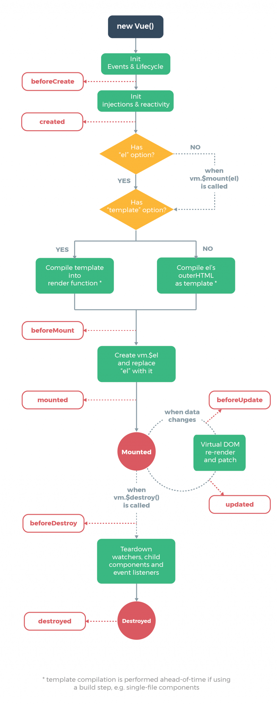

# demo

## Project setup
```
npm install
```

### Compiles and hot-reloads for development
```
npm run serve
```

### Compiles and minifies for production
```
npm run build
```

### Lints and fixes files
```
npm run lint
```

### Customize configuration
See [Configuration Reference](https://cli.vuejs.org/config/).

## Vue  Life Cycle


[Image Source](https://vuejs.org/v2/guide/instance.html).

1. beforeCreate：實例初始化。
2. Created：實例建立完成(可以取得 $data)。
3. beforeMount：模板掛載之前(還沒有生成html)。
4. mounted：模板掛載完成。
5. beforeUpdate：如果data發生改變，觸發組件更新，重新渲染。
6. updated：更新完成。
7. beforeDestroy：實例銷毀之前(實例還可以使用)。
8. destroyed：實例已銷毀(所有綁定被解除、所有事件監聽器被移除、所有子實例被移除)。

[Draw_Lots](https://hsu-hui.github.io/Vue-demo/Draw_Lots/draw.html)
